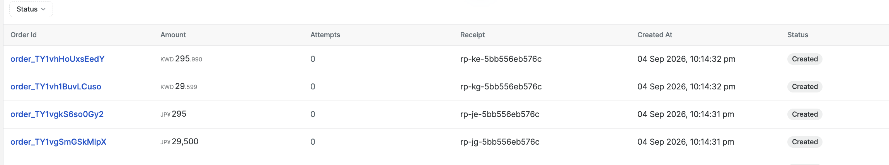
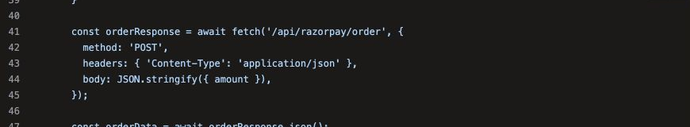
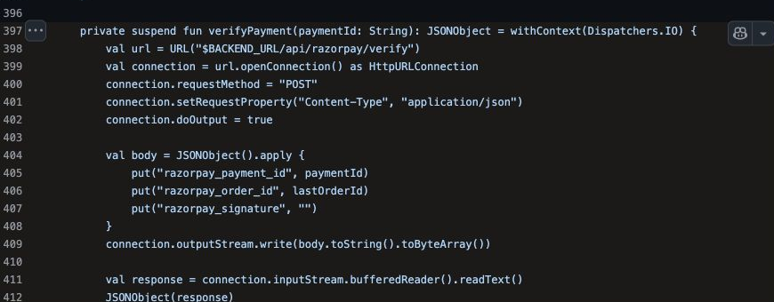

<!--
Copyright (c) 2026 Achyuth Jayadevan <achyuth@jayadevan.in>
SPDX-License-Identifier: MIT
Licensed under the MIT License. See LICENSE in the repository root.
-->

<h1 align="center">RazorLean</h1>
<p align="center"><strong>A semantic payment firewall for Razorpay.</strong><br>Prove the payment, not just the signature.</p>
<p align="center"><a href="https://achxy.github.io/RazorLean/"><strong>Open the interactive investigation</strong></a> · <a href="razorproof-rs/openapi.yaml">OpenAPI</a> · <a href="razorproof-rs/docs/ARCHITECTURE.md">Architecture</a> · <a href="razorproof-rs/DEMO.md">Runbook</a></p>
<p align="center"><a href="https://github.com/Achxy/RazorLean/actions/workflows/ci.yml"></a> <a href="https://github.com/Achxy/RazorLean/actions/workflows/pages.yml"></a> <a href="LICENSE"></a></p>

RazorLean is the public repository for **RazorProof**, a Rust service that turns a payment request into a constrained state transition. It checks whether economic meaning survives price construction, currency conversion, retry, account routing, signing, provider execution, webhook delivery, and fulfillment.

> A cryptographically valid payment can still be the wrong payment. Authentication proves that a provider tuple is authentic. It does not prove that the tuple represents the merchant's intended cart, currency quantum, tenant, retry identity, or lifecycle transition.

## Start with the failure

An official integration generator can accept a browser-authored amount, apply a fixed two-decimal conversion, create a valid provider order, and later verify the genuine provider signature. For JPY, `295 × 100` becomes `29,500` even though JPY uses zero decimal places. The signature is real. The order is paid. The economic intent is wrong.

<p align="center"><a href="https://achxy.github.io/RazorLean/#failure"></a></p>

The screenshot is the actual Razorpay Orders surface from the Test Mode campaign. It shows the wrong generated integers beside exact controls. Razorpay correctly persisted the values it received; RazorProof prevents the intent from being lost before that request exists.

## The executable boundary

```text
browser intent
      │
      ▼
┌─────────────────────────────────────────────────────────────┐
│ RAZORPROOF                                                  │
│ server quote · exact money · tenant · effect identity      │
│ raw webhook bytes · provider re-fetch · one fulfillment    │
└─────────────────────────────────────────────────────────────┘
      │                         ▲
      ▼                         │
 Razorpay API ───────── signed event + provider state
```

| Coordinate | Question | Enforcement |
|---|---|---|
| Value | Is the amount exact for this currency? | Decimal parsing and currency exponent |
| Principal | Which merchant account owns the request? | Tenant-fixed client and route |
| Effect | Is this retry the same economic action? | Durable idempotency identity |
| Provenance | Are these the exact signed bytes? | Raw-body verification |
| Lifecycle | Is this state transition legal and final? | Provider re-fetch and state machine |

## Failure chains

The interactive investigation separates reproduced defects, source-bound defects, compatibility defects, safety gaps, hardening opportunities, documentation drift, provider observations, controls, and explicit inference.

<table>
  <tr><td width="50%"></td><td width="50%"></td></tr>
  <tr><td><strong>Economics detached from the quote</strong><br>Browser authority plus a fixed exponent can produce a genuine, wrong-priced paid order.</td><td><strong>Paid but unverifiable</strong><br>Generated native callbacks can discard the signature their own verifier requires.</td></tr>
  <tr><td></td><td></td></tr>
  <tr><td><strong>Mutation plus retry amplification</strong><br>A refund can be changed before dispatch; missing effect identity makes a retry a new refund.</td><td><strong>Event visibility loss</strong><br>Changing signed UTF-8 bytes to ASCII can make genuine webhook deliveries disappear.</td></tr>
</table>

Open the [interactive case explorer](https://achxy.github.io/RazorLean/#cases) for the complete inspectable set and direct links to pinned official source.

## Run it

```bash
git clone https://github.com/Achxy/RazorLean.git
cd RazorLean/razorproof-rs
cargo test --workspace --all-targets
cargo run -p razorproof-cli -- self-test
```

Use the [demo runbook](razorproof-rs/DEMO.md) for the end-to-end flow. Provider probes accept only Test Mode credentials; no Live Mode transaction is attempted.

## Repository map

| Path | Purpose |
|---|---|
| [`razorproof-rs/`](razorproof-rs/) | Rust semantic boundary service and CLI |
| [`razorproof-rs/openapi.yaml`](razorproof-rs/openapi.yaml) | HTTP contract |
| [`src/razorproof/`](src/razorproof/) | Conformance compiler and reproducible probes |
| [`artifacts/`](artifacts/) | Sanitized machine-readable evidence |
| [`site/`](site/) | Interactive GitHub Pages investigation, built with Razorpay Blade |

## License

Created by Achyuth Jayadevan. Released under the [MIT License](LICENSE).
