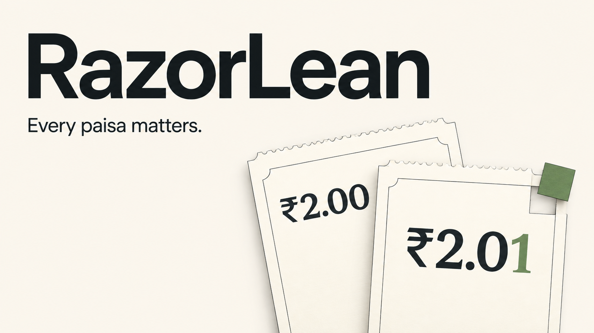
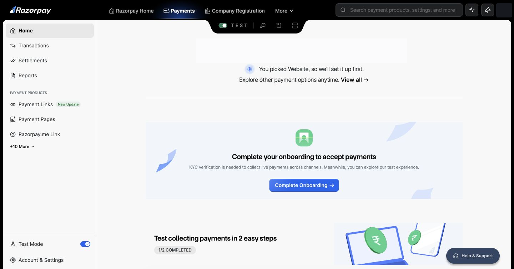
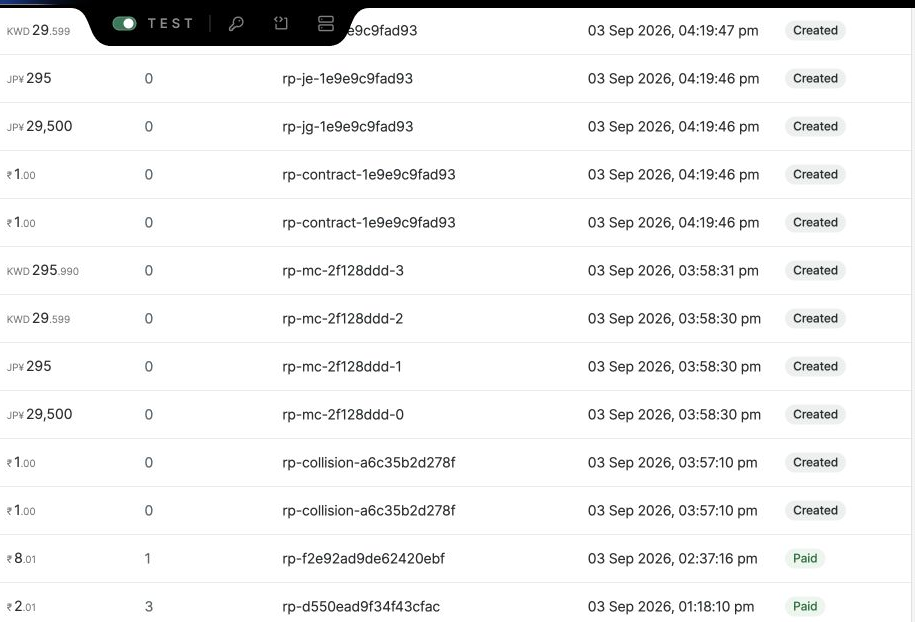
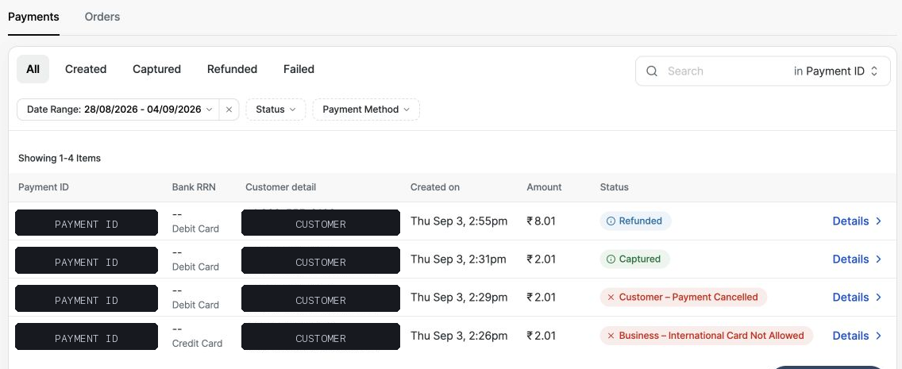
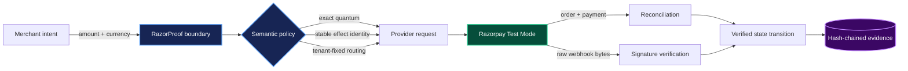
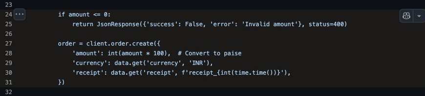
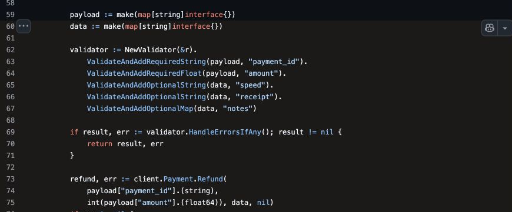
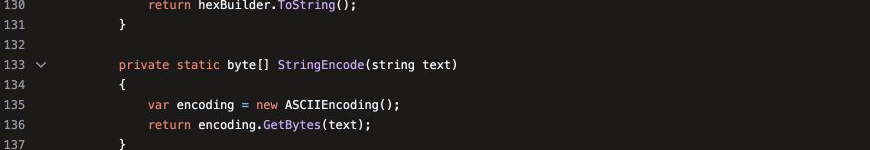
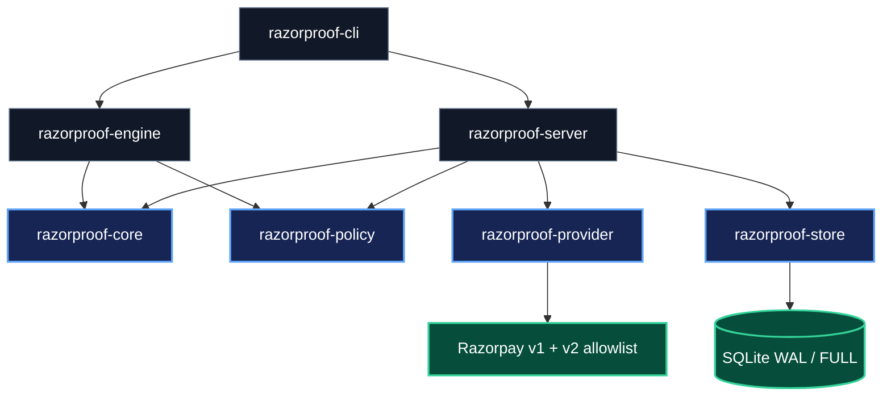
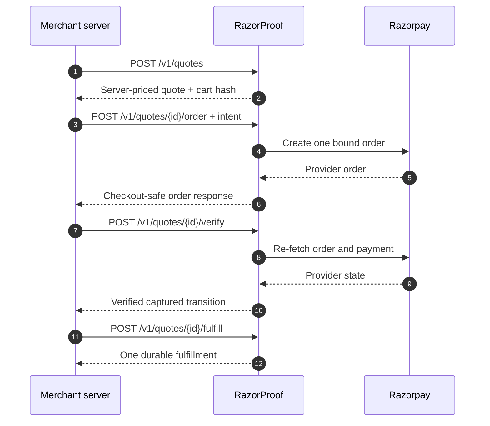

<!--
Copyright (c) 2026 Achyuth Jayadevan <achyuth@jayadevan.in>
SPDX-License-Identifier: MIT

Licensed under the MIT License. See LICENSE in the repository root.
-->

<p align="center">
  
</p>

<h1 align="center">RazorLean</h1>

<p align="center">
  <strong>A semantic payment firewall for Razorpay.</strong><br>
  Exact money, durable effect identity, verified checkout state, and tamper-evident evidence at one executable boundary.
</p>

<p align="center">
  <a href="https://github.com/Achxy/RazorLean/actions/workflows/ci.yml"></a>
  <a href="razorproof-rs/Cargo.toml"></a>
  <a href="pyproject.toml"></a>
  <a href="LICENSE"></a>
</p>

<p align="center">
  <a href="#see-the-surface">Evidence</a> ·
  <a href="#one-boundary-seven-correctness-domains">Architecture</a> ·
  <a href="#run-the-firewall">Run it</a> ·
  <a href="razorproof-rs/DEMO.md">Demo</a> ·
  <a href="artifacts/INDEX.md">Artifact index</a> ·
  <a href="razorproof-rs/openapi.yaml">OpenAPI</a>
</p>

RazorLean is the public repository for **RazorProof**, a Rust service that turns a payment request into a constrained state transition, and the Python conformance tooling used to find and reproduce cross-layer payment failures. It does not merely validate JSON. It checks whether the economic meaning survives conversion, retry, signing, provider execution, webhook delivery, and reconciliation.

## See the surface

The evidence below comes from Razorpay Test Mode and pinned official Razorpay source. It is not a mock dashboard and not a RazorLean-authored UI.

<p align="center">
  <a href="razorproof-rs/video/manim/assets/evidence/razorpay-dashboard-test-mode.png"></a>
</p>

<p align="center"><em>The actual Razorpay dashboard used for the provider-observed campaign.</em></p>

<table>
  <tr>
    <td width="50%" align="center"><strong>Order semantics</strong></td>
    <td width="50%" align="center"><strong>Payment lifecycle</strong></td>
  </tr>
  <tr>
    <td><a href="razorproof-rs/video/manim/assets/evidence/razorpay-orders-anomaly-matrix.png"></a></td>
    <td><a href="razorproof-rs/video/manim/assets/evidence/razorpay-payment-status-matrix.png"></a></td>
  </tr>
  <tr>
    <td>Integer controls, currency pairs, receipt behavior, and a persisted fractional-refund observation.</td>
    <td>Provider-visible captured and refunded states reconciled against payment identifiers.</td>
  </tr>
</table>

## The problem is larger than one endpoint

A payment can be locally valid and still be economically wrong. RazorProof follows the same intent across every representation that can change its meaning.



The boundary answers five questions before a write is trusted:

1. Is the amount an exact integer number of subunits for this currency?
2. Is this a new economic effect, a replay of the same effect, or identity reuse with different input?
3. Are tenant, account, API version, and provider route fixed before dispatch?
4. Does the returned payment still match the server quote and provider order?
5. Can the transition be independently verified without retaining sensitive provider payloads?

## Failure atlas

RazorProof combines executable probes with source binding. Each finding retains its evidence strength and claim type, so a direct defect, compatibility defect, safety gap, hardening opportunity, and documentation defect cannot be quietly counted as the same thing.

<table>
  <tr>
    <td width="50%"><a href="razorproof-rs/video/manim/assets/evidence/github-generated-money.png"></a></td>
    <td width="50%"><a href="razorproof-rs/video/manim/assets/evidence/github-fractional-refund.png"></a></td>
  </tr>
  <tr>
    <td><strong>Money representation</strong><br>Execute emitted conversions and compare them with exact currency-quantum arithmetic.</td>
    <td><strong>Contract enforcement</strong><br>Probe whether an integer-subunit contract is actually enforced along the reachable request path.</td>
  </tr>
  <tr>
    <td><a href="razorproof-rs/video/manim/assets/evidence/github-dotnet-ascii-clip.png"></a></td>
    <td><a href="razorproof-rs/video/manim/assets/evidence/github-mobile-empty-signature.png"></a></td>
  </tr>
  <tr>
    <td><strong>Webhook bytes</strong><br>Verify the exact received bytes and test non-ASCII payloads against the SDK implementation.</td>
    <td><strong>Trust boundaries</strong><br>Trace whether a verifier can silently accept missing or structurally empty authentication material.</td>
  </tr>
</table>

<p align="center">
  <a href="artifacts/razorpay-test/campaign-summary.md"><strong>Provider campaign</strong></a> ·
  <a href="artifacts/expanded/case-report.md"><strong>Generated case report</strong></a> ·
  <a href="artifacts/chains/chained-bug-evidence.md"><strong>Compositional chains</strong></a> ·
  <a href="artifacts/fixes-container/fix-proof.md"><strong>Red-to-green proof</strong></a>
</p>

## Proof ledger

| Surface | Evidence | Current result |
|---|---|---:|
| Rust workspace | Local executable | 26 unit and integration tests pass |
| Exact INR, JPY, and KWD conversion | Local executable | Exact subunits accepted; invalid quantum rejected |
| Official MCP surface | Source-bound executable | 45 / 45 tools mapped; drift fails the check |
| Official SDK and generator corpus | Source-bound executable | 662 files and 2,683,730 bytes scanned |
| Repository observations | Reproducible audit | 23 findings composed into 6 proof-graded chains |
| Razorpay authentication | Provider-observed | Test Mode API returned HTTP 200 |
| Order creation through the firewall | Provider-observed | ₹2.01 represented as exactly 201 INR subunits |
| Durable event evidence | Independently verified | Four-event chain verifies end to end |
| Policy catalog | Implemented | 113 operations across 20 payment surfaces |

The numbers above are deliberately scoped. Policy coverage is not the same as provider execution, and a static source observation is not promoted to a runtime defect. The detailed boundaries and supporting files are in the [claim ledger](artifacts/expanded/claim-ledger.md) and [artifact index](artifacts/INDEX.md).

## One boundary, seven correctness domains



| Crate | Responsibility |
|---|---|
| `razorproof-core` | Exact money, intent identities, quotes, signatures, and canonical evidence |
| `razorproof-policy` | Versioned operations, monetary JSON paths, effects, access, API version, and idempotency |
| `razorproof-provider` | Origin-restricted HTTP, immutable routing, bounded responses, safe retry rules, and multipart validation |
| `razorproof-store` | Optimistic quote transitions, durable effect claims, webhook deduplication, and append-only evidence |
| `razorproof-engine` | Deterministic semantic detectors and compositional failure chains across official source |
| `razorproof-server` | Authenticated REST boundary, checkout lifecycle, guarded operations, and webhook ingress |
| `razorproof-cli` | Self-test, coverage, scanning, Test Mode probes, evidence verification, and service operation |

Read the [architecture](razorproof-rs/docs/ARCHITECTURE.md), [threat model](razorproof-rs/docs/THREAT-MODEL.md), and [OpenAPI contract](razorproof-rs/openapi.yaml) for the complete boundary.

## Run the firewall

Requirements: Rust 1.90 or newer. Start without provider credentials:

```bash
git clone https://github.com/Achxy/RazorLean.git
cd RazorLean/razorproof-rs

cargo test --workspace --all-targets
cargo run -p razorproof-cli -- self-test
```

Inspect a pinned local clone of Razorpay's official MCP server and SDK repositories:

```bash
cargo run -p razorproof-cli -- coverage \
  --source ../.razorproof/current/razorpay-mcp-server
cargo run -p razorproof-cli -- scan \
  --repositories ../.razorproof/repos
```

Run the provider probe with a Razorpay Test Mode CSV kept outside Git:

```bash
cargo run -p razorproof-cli -- probe-test-mode \
  --key-csv /absolute/path/to/rzp-key.csv
```

Start the service with local secrets supplied through the environment or a secret manager:

```bash
export RAZORPROOF_KEY_CSV=/absolute/path/to/rzp-key.csv
export RAZORPROOF_GATEWAY_TOKEN='replace-with-at-least-24-random-characters'
export RAZORPROOF_WEBHOOK_SECRET='replace-with-dashboard-test-webhook-secret'
cargo run -p razorproof-cli -- serve
```

The timed end-to-end sequence is in the [demo runbook](razorproof-rs/DEMO.md).

## Core API flow



Every accepted transition emits a content hash and a chained event hash. The verification path uses the server-bound order identifier, re-fetches provider state, and requires amount, currency, order, payment, signature, and lifecycle agreement before fulfillment advances.

## Reproduce the research tooling

The Python package performs clean-clone repository scans, container probes, the lost-response fault lab, provider campaigns, chain construction, and red-to-green remediation proofs.

```bash
cd RazorLean
python3 -m venv .venv
.venv/bin/pip install -e .
.venv/bin/razorproof repos --clone-missing
.venv/bin/razorproof scan --containers
.venv/bin/razorproof fault-lab
.venv/bin/razorproof build-chains
.venv/bin/razorproof prove-fixes --containers
```

Generated outputs land in `artifacts/latest/`: `scan.json`, `case-report.md`, and `claim-ledger.md`. Use `--fail-on critical` or `--fail-on high` to turn the scan into a CI policy gate.

## Repository guide

| Path | Purpose |
|---|---|
| [`razorproof-rs/`](razorproof-rs/) | Rust workspace and production-oriented boundary service |
| [`razorproof-rs/openapi.yaml`](razorproof-rs/openapi.yaml) | HTTP request and response contract |
| [`src/razorproof/`](src/razorproof/) | Python semantic-conformance compiler and campaign tooling |
| [`research/expanded-bug-audit/`](research/expanded-bug-audit/) | Source-bound audit, feature checks, and architecture case |
| [`artifacts/`](artifacts/) | Sanitized provider, chain, registry, fault-lab, and fix evidence |
| [`razorproof-rs/video/manim/`](razorproof-rs/video/manim/) | Modular Manim film source and visual evidence manifest |

## Film source

The repository includes the modular Manim production used to explain the system through Alice and Bob, real provider screenshots, official-source clips, and synchronized narration cues.

<p align="center">
  <a href="razorproof-rs/video/manim/README.md"></a>
</p>

See the [film build guide](razorproof-rs/video/manim/README.md), [voice-over cue sheet](razorproof-rs/video/manim/VOICEOVER_CUE_SHEET.md), and [evidence manifest](razorproof-rs/video/manim/assets/evidence/manifest.json).

## License

Created by Achyuth Jayadevan. Released under the [MIT License](LICENSE).
